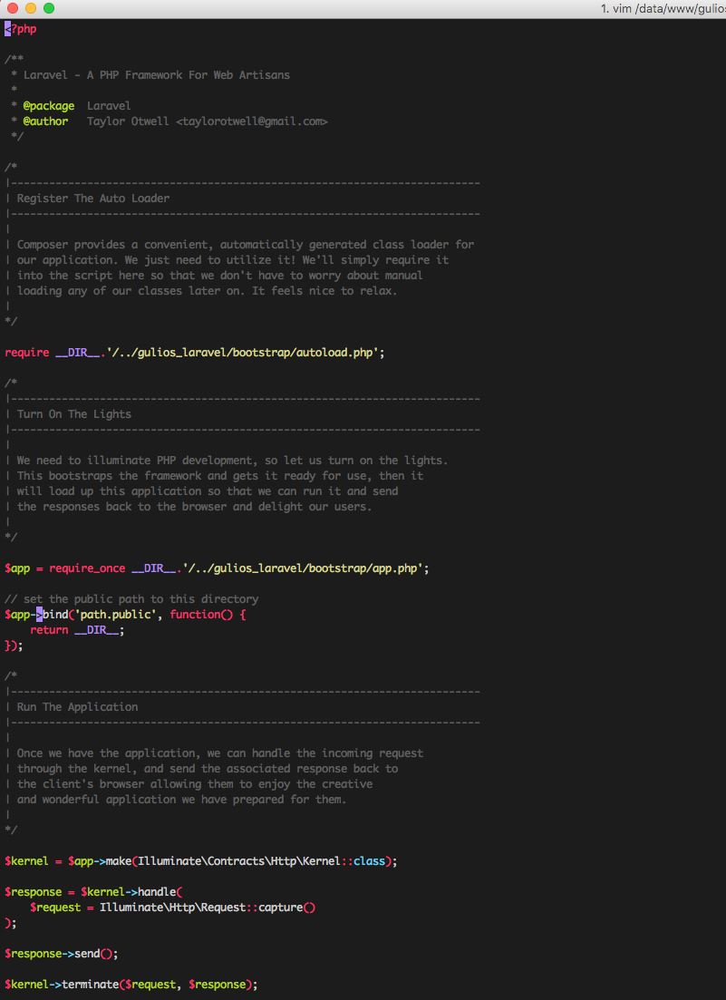

Monokai VIM color scheme
===========

* Founded in [crusoexia/vim-monokai](https://github.com/crusoexia/vim-monokai)

#### Installation
* pull repo
* create symlink to files(change path to your local repos)
<pre>

cd ~ && ln -s /www/github/vim-monokai .vim

</pre>

* check  which vimrc is being used, you can ask inside of vim by typing:
<pre>
 :echo $MYVIMRC 
</pre>

Screenshot
----------

